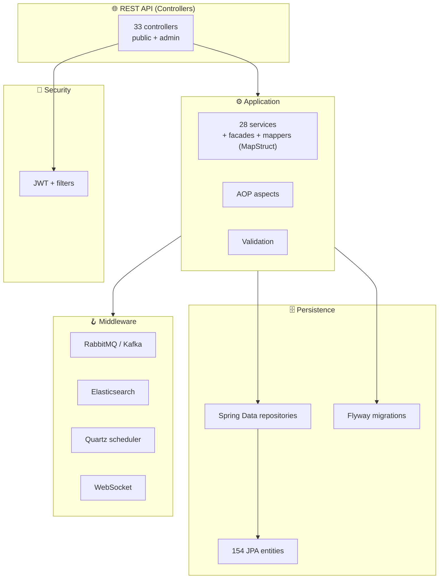
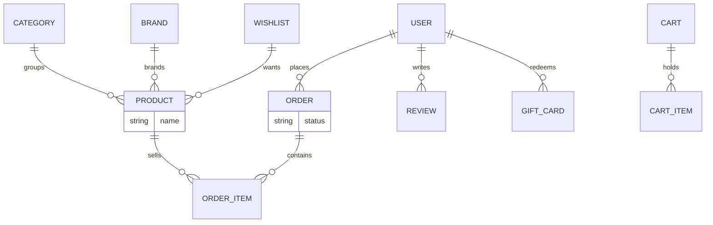
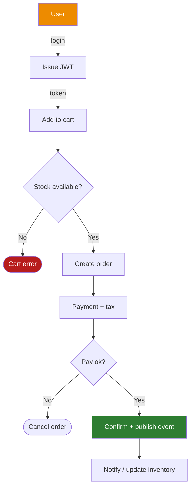

<div align="center">

**🌐 Choose Language / Selecione o Idioma / Elija el Idioma**

[](README.md)&nbsp;&nbsp;&nbsp;[](README_PT.md)&nbsp;&nbsp;&nbsp;[](README_ES.md)

</div>

---

<div align="center">

```
███████╗ ██████╗ ██████╗ ███╗   ███╗███╗   ███╗███████╗██████╗  ██████╗███████╗    ██╗ █████╗ ██╗   ██╗ █████╗
██╔════╝██╔════╝██╔═══██╗████╗ ████║████╗ ████║██╔════╝██╔══██╗██╔════╝██╔════╝    ██║██╔══██╗██║   ██║██╔══██╗
█████╗  ██║     ██║   ██║██╔████╔██║██╔████╔██║█████╗  ██████╔╝██║     █████╗      ██║███████║██║   ██║███████║
██╔══╝  ██║     ██║   ██║██║╚██╔╝██║██║╚██╔╝██║██╔══╝  ██╔══██╗██║     ██╔══╝      ██║██╔══██║╚██╗ ██╔╝██╔══██║
███████╗╚██████╗╚██████╔╝██║ ╚═╝ ██║██║ ╚═╝ ██║███████╗██║  ██║╚██████╗███████╗    ██║██║  ██║ ╚████╔╝ ██║  ██║
╚══════╝ ╚═════╝ ╚═════╝ ╚═╝     ╚═╝╚═╝     ╚═╝╚══════╝╚═╝  ╚═╝ ╚═════╝╚══════╝    ╚═╝╚═╝  ╚═╝  ╚═══╝  ╚═╝  ╚═╝
                         Full-Featured Java E-commerce Platform
```

---

[](https://openjdk.org/)
[](https://spring.io/)
[]()
[]()
[]()
[]()
[]()
[]()

<br/>

> **A full-featured e-commerce platform on Spring Boot 3 with JWT security**
> covering catalog, carts, orders, payments, reviews, loyalty, gift cards, admin and search — orchestrated over PostgreSQL, Redis, Kafka and Elasticsearch.

<br/>


</div>

---

## 📑 Table of Contents

<details>
<summary>▶️ <strong>Click to expand / collapse this section</strong></summary>

<table>
<tr>
<td valign="top" width="50%">

**🏗️ System**
- [Overview](#-overview)
- [System Architecture](#-system-architecture)
- [Technology Stack](#-technology-stack)
- [Design Patterns](#-design-patterns-applied)
- [Project Structure](#-project-structure)

**📦 Modules**
- [Catalog & Search](#-catalog--search)
- [Commerce & Payments](#-commerce--payments)
- [Engagement & Admin](#-engagement--admin)

</td>
<td valign="top" width="50%">

**💼 Business**
- [Business Rules](#-business-rules)
- [Functional Requirements](#-functional-requirements)
- [Non-Functional Requirements](#-non-functional-requirements)

**🔐 Security & Ops**
- [Data Model](#-data-model)
- [System Flows](#-system-flows)
- [Security](#-security)
- [Installation & Execution](#-installation--execution)
- [Automated Tests](#-automated-tests)
- [Metrics & Monitoring](#-metrics--monitoring)
- [Known Limitations](#-known-limitations)

</td>
</tr>
</table>

---

</details>

## 🌟 Overview

<details>
<summary>▶️ <strong>Click to expand / collapse this section</strong></summary>

**ecommerce-java** is a feature-complete Spring Boot 3.2 e-commerce backend (`com.ecommerce`, 587 main Java files). It implements the full retail lifecycle: JWT-authenticated users and roles, a product catalog with categories and brands, shopping carts, order processing with payments, product reviews, wishlists, gift cards, a loyalty program, newsletters, support tickets, and a comprehensive admin suite for inventory, marketing, reports, webhooks, CMS and audit logs.

The platform is wired for scale with PostgreSQL (JPA + Flyway migrations), Redis (cache + sessions), Elasticsearch (search), RabbitMQ and Kafka (messaging/events), Quartz (scheduling), WebSocket (real-time) and OpenAPI docs.

### 🎯 System Objectives

| Objective | Description |
|-----------|-------------|
| 🛒 **Complete commerce** | Catalog, carts, orders, payments, reviews |
| 🎁 **Loyalty & gifts** | Loyalty program, gift cards, returns |
| 🛠️ **Rich admin** | Inventory, marketing, reports, webhooks, CMS, support |
| 🔍 **Fast search** | Elasticsearch-backed product search |
| 🔐 **Secure access** | JWT + Spring Security, roles and audit |
| ⚙️ **Scalable pipe** | Redis, Kafka, RabbitMQ, Quartz, WebSocket |

---

</details>

## 🏗️ System Architecture

<details>
<summary>▶️ <strong>Click to expand / collapse this section</strong></summary>

### Module Diagram



Layered controllers → services → repositories with cross-cutting aspects, secured by a JWT filter chain and powered by an async/event-driven backbone.

---

</details>

## 🛠️ Technology Stack

<details>
<summary>▶️ <strong>Click to expand / collapse this section</strong></summary>

<table>
<thead>
<tr><th>Layer</th><th>Technology</th><th>Version</th><th>Purpose</th></tr>
</thead>
<tbody>
<tr><td><strong>🧠 Language</strong></td><td>Java</td><td>17</td><td>All application logic — 587 files</td></tr>
<tr><td><strong>🌐 Framework</strong></td><td>Spring Boot</td><td>3.2.0</td><td>Web, JPA, Security, Validation, Mail, AOP</td></tr>
<tr><td><strong>🗄️ Database</strong></td><td>PostgreSQL / H2</td><td>16 / runtime</td><td>Primary and test databases</td></tr>
<tr><td><strong>🧬 Migrations</strong></td><td>Flyway</td><td>Latest</td><td>DB schema versioning</td></tr>
<tr><td><strong>🔍 Search</strong></td><td>Elasticsearch</td><td>Starter</td><td>Product search index</td></tr>
<tr><td><strong>📨 Messaging</strong></td><td>RabbitMQ + Kafka</td><td>Starter</td><td>Async events/streams</td></tr>
<tr><td><strong>⚡ Cache</strong></td><td>Redis + Spring Cache</td><td>3.2.0</td><td>Caching + sessions</td></tr>
<tr><td><strong>🔐 Auth</strong></td><td>JWT (jjwt)</td><td>0.12.3</td><td>Token auth</td></tr>
<tr><td><strong>📋 Mapping</strong></td><td>MapStruct + ModelMapper</td><td>1.5.5</td><td>DTO mapping</td></tr>
<tr><td><strong>🧪 Tests</strong></td><td>JUnit + Testcontainers</td><td>—</td><td>40 test files</td></tr>
<tr><td><strong>📜 Docs</strong></td><td>springdoc-openapi</td><td>2.3.0</td><td>Swagger/OpenAPI</td></tr>
</tbody>
</table>

---

</details>

## 🎨 Design Patterns Applied

<details>
<summary>▶️ <strong>Click to expand / collapse this section</strong></summary>

| Pattern | Where | Rationale |
|---------|-------|-----------|
| 🏗️ **Layered architecture** | Controller / service / repository | Clear separation of concerns |
| 🏭 **Facade** | `facade` package | Simplifies complex service combinations |
| 🔄 **Mapper pattern** | MapStruct mappers | Entity ↔ DTO conversion at compile time |
| ✂️ **AOP** | `aspect` package | Cross-cutting concerns (logging, security) |
| 📨 **Event-driven** | Kafka/RabbitMQ `messaging` + listeners | Decoupled async flows |
| ⛓️ **Filter chain** | `security` JWT filter | Central authentication |
| 📅 **Scheduler** | Quartz `scheduler` | Periodic jobs (reports, alerts) |

---

</details>

## 📁 Project Structure

<details>
<summary>▶️ <strong>Click to expand / collapse this section</strong></summary>

```
ecommerce-java/
├── 📄 pom.xml                       # Maven build (Spring Boot 3.2.0)
├── 📂 src/main/java/com/ecommerce/
│   ├── 📂 controller/               # 33 REST controllers
│   ├── 📂 service/                  # 28 application services
│   ├── 📂 model/entity/             # 154 JPA entities
│   ├── 📂 repository/               # Spring Data repositories
│   ├── 📂 config/                   # 14 @Configuration classes
│   ├── 📂 security/                 # JWT + filter chain
│   ├── 📂 messaging/ listener/      # Kafka/RabbitMQ
│   ├── 📂 facade/ mapper/ aspect/
│   ├── 📂 scheduler/ event/ handler/
│   └── 📂 exception/ util/ validation/
├── 📂 src/test/                     # 40 test files
├── 📂 docker/  scripts/  docs/
└── 📄 README.md / README_PT.md / README_ES.md
```

---

</details>

## 📦 System Modules

<details>
<summary>▶️ <strong>Click to expand / collapse this section</strong></summary>

### 🔍 Catalog & Search

`ProductController` + `CategoryController` + `BrandController` + `SearchController`, product reviews, wishlists, and Elasticsearch-backed search over the 154-entity JPA model.

### 💳 Commerce & Payments

`CartController`, `OrderController`, `PaymentController`, `TaxController`, addresses, gift cards, loyalty and returns — the transactional backbone with RabbitMQ/Kafka event publishing.

### 🎛️ Engagement & Admin

`AuthController`, `UserController`, `NotificationController`, `NewsletterController`, support tickets, plus the `Admin*` family: analytics, audit log, CMS, inventory, marketing, reports, settings, webhooks and search management.

---

</details>

## 📋 Business Rules

<details>
<summary>▶️ <strong>Click to expand / collapse this section</strong></summary>

| # | Rule | Enforcement |
|---|------|-------------|
| BR-01 | Only authenticated users may place orders | JWT-aware order service |
| BR-02 | Cart items must reference valid products | Repository/validation checks |
| BR-03 | Payments gate the order state transition | Payment service before order confirmation |
| BR-04 | Admin endpoints require privileged roles | Role-secured `Admin*` controllers |
| BR-05 | Loyalty points and gift cards reduce order totals | Business logic in service layer |

---

</details>

## ✅ Functional Requirements

<details>
<summary>▶️ <strong>Click to expand / collapse this section</strong></summary>

| ID | Requirement | Priority | Status |
|----|-------------|----------|--------|
| **RF-01** | Register, authenticate and manage users (JWT) | 🔴 High | ✅ Implemented |
| **RF-02** | Browse categories, brands and product catalog | 🔴 High | ✅ Implemented |
| **RF-03** | Manage carts and place orders with payments | 🔴 High | ✅ Implemented |
| **RF-04** | Write product reviews and manage wishlists | 🟡 Medium | ✅ Implemented |
| **RF-05** | Run loyalty program and gift cards | 🟡 Medium | ✅ Implemented |
| **RF-06** | Admin: inventory, marketing, reports, webhooks, CMS | 🟡 Medium | ✅ Implemented |
| **RF-07** | Full-text product search via Elasticsearch | 🟡 Medium | ✅ Implemented |
| **RF-08** | Collect metrics and expose OpenAPI docs | 🟡 Medium | ✅ Implemented |

---

</details>

## ⚡ Non-Functional Requirements

<details>
<summary>▶️ <strong>Click to expand / collapse this section</strong></summary>

| ID | Category | Requirement | Target |
|----|----------|-------------|--------|
| **RNF-01** | 🔐 Security | Token-based API security | JWT + Spring Security |
| **RNF-02** | ⚡ Performance | Cached reads | Redis + Spring Cache |
| **RNF-03** | 📈 Scalability | Async, decoupled processing | Kafka + RabbitMQ |
| **RNF-04** | 🔍 Search | Fast full-text queries | Elasticsearch |
| **RNF-05** | 📊 Observability | Actuator + OpenAPI | spring-boot-actuator/springdoc |
| **RNF-06** | 🧱 Maintainability | Layered, testable code | 40 test files |

---

</details>

## 🗄️ Data Model

<details>
<summary>▶️ <strong>Click to expand / collapse this section</strong></summary>



154 JPA entities are versioned by Flyway migrations against PostgreSQL (H2 in tests); Redis caches hot reads and Elasticsearch indexes products for search.

---

</details>

## 🔄 System Flows

<details>
<summary>▶️ <strong>Click to expand / collapse this section</strong></summary>



---

</details>

## 🔐 Security

<details>
<summary>▶️ <strong>Click to expand / collapse this section</strong></summary>

### Implemented Controls

| Control | Implementation |
|---------|---------------|
| 🔑 **JWT auth** | jjwt + Spring Security filter chain |
| 🚦 **Roles** | Privileged admin controllers role-gated |
| 🛂 **Input validation** | `spring-boot-starter-validation` + custom validators |
| 🔒 **Password handling** | Spring Security encoder |
| 📋 **Audit** | Admin audit log + user audit endpoints |

### Known Security Limitations

| Limitation | Risk | Mitigation path |
|------------|------|-----------------|
| 🔐 **Refresh/revocation** | JWT lifetime vs. revocation | Add refresh tokens + blacklist in Redis |
| 🌐 **Deployment hardening** | Secrets/PLAIN config in dev | Use env-driven vault for production |

---

</details>

## 🚀 Installation & Execution

<details>
<summary>▶️ <strong>Click to expand / collapse this section</strong></summary>

### Prerequisites

```bash
java -version           # JDK 17+
docker --version        # for PostgreSQL/Redis/etc via compose
```

### Build & Run

```bash
mvn clean install
mvn spring-boot:run
```

Tests use Testcontainers for PostgreSQL:

```bash
mvn test
```

---

</details>

## 🧪 Automated Tests

<details>
<summary>▶️ <strong>Click to expand / collapse this section</strong></summary>

40 test files under `src/test` cover services and web layers:

```bash
mvn test
```

- **JUnit + spring-boot-starter-test** for unit/integration
- **Testcontainers (postgresql)** for real-database integration
- **spring-security-test** for secured endpoint verification
- **junit-dataprovider** for data-driven cases

---

</details>

## 📊 Metrics & Monitoring

<details>
<summary>▶️ <strong>Click to expand / collapse this section</strong></summary>

| Metric | Value |
|--------|-------|
| Java files | 587 |
| Entities | 154 |
| Controllers | 33 |
| Services | 28 |
| Spring configs | 14 |
| Tests | 40 |

Spring Boot Actuator exposes health/metrics endpoints; springdoc-openapi serves the Swagger UI and OpenAPI spec.

---

</details>

## ⚠️ Known Limitations

<details>
<summary>▶️ <strong>Click to expand / collapse this section</strong></summary>

| Category | Issue | Status |
|----------|-------|--------|
| 🔍 **Search sync** | Search index consistency with RDBMS | ⚠️ Open — align via events |
| 🎛️ **Admin breadth** | Many admin modules, uneven depth | ⚠️ Open — refine per module |
| 🔐 **Token lifecycle** | No JWT refresh/revocation yet | ⚠️ Open — add refresh flow |

</details>

---

<div align="center">

---

### 🛒 ecommerce-java

*Every retail flow, one Spring Boot platform*

[]()
[]()

<br/>

```
"From cart to loyalty, from search to admin — a complete store in code."
```

</div>
