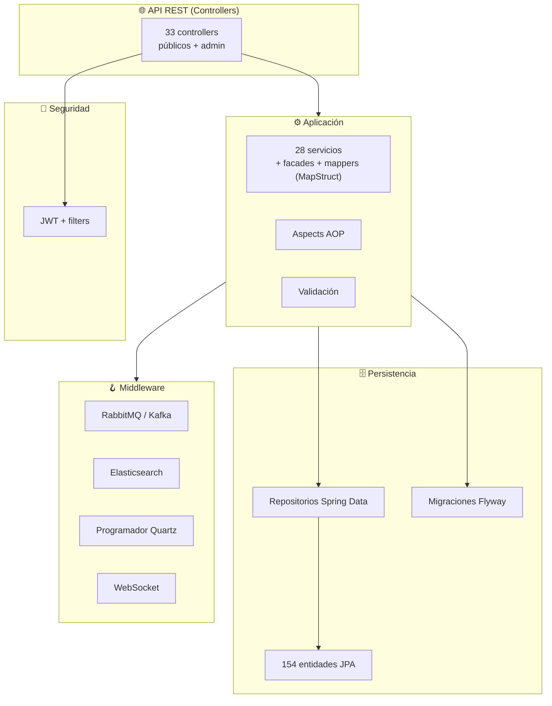
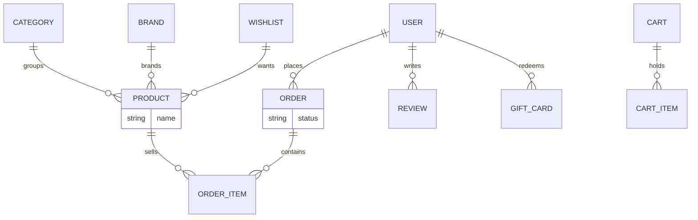
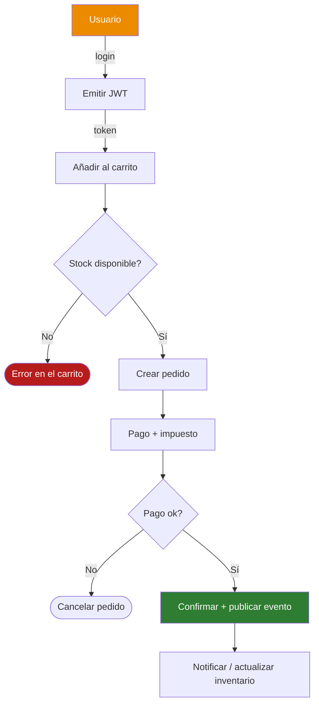

<div align="center">

**🌐 Choose Language / Selecione o Idioma / Elija el Idioma**

[](README.md)&nbsp;&nbsp;&nbsp;[](README_PT.md)&nbsp;&nbsp;&nbsp;[](README_ES.md)

</div>

---

<div align="center">

```
███████╗ ██████╗ ██████╗ ███╗   ███╗███╗   ███╗███████╗██████╗  ██████╗███████╗    ██╗ █████╗ ██╗   ██╗ █████╗
██╔════╝██╔════╝██╔═══██╗████╗ ████║████╗ ████║██╔════╝██╔══██╗██╔════╝██╔════╝    ██║██╔══██╗██║   ██║██╔══██╗
█████╗  ██║     ██║   ██║██╔████╔██║██╔████╔██║█████╗  ██████╔╝██║     █████╗      ██║███████║██║   ██║███████║
██╔══╝  ██║     ██║   ██║██║╚██╔╝██║██║╚██╔╝██║██╔══╝  ██╔══██╗██║     ██╔══╝      ██║██╔══██║╚██╗ ██╔╝██╔══██║
███████╗╚██████╗╚██████╔╝██║ ╚═╝ ██║██║ ╚═╝ ██║███████╗██║  ██║╚██████╗███████╗    ██║██║  ██║ ╚████╔╝ ██║  ██║
╚══════╝ ╚═════╝ ╚═════╝ ╚═╝     ╚═╝╚═╝     ╚═╝╚══════╝╚═╝  ╚═╝ ╚═════╝╚══════╝    ╚═╝╚═╝  ╚═╝  ╚═══╝  ╚═╝  ╚═╝
                       Plataforma E-commerce Java Completa en Funcionalidades
```

---

[](https://openjdk.org/)
[](https://spring.io/)
[]()
[]()
[]()
[]()
[]()
[]()

<br/>

> **Una plataforma de e-commerce completa en Spring Boot 3 con seguridad JWT**
> que cubre catálogo, carritos, pedidos, pagos, reseñas, fidelidad, gift cards, admin y búsqueda — orquestada sobre PostgreSQL, Redis, Kafka y Elasticsearch.

<br/>


</div>

---

## 📑 Tabla de Contenidos

<details>
<summary>▶️ <strong>Haga clic para expandir / contraer esta sección</strong></summary>

<table>
<tr>
<td valign="top" width="50%">

**🏗️ Sistema**
- [Visión General](#-visión-general)
- [Arquitectura del Sistema](#-arquitectura-del-sistema)
- [Stack Tecnológico](#-stack-tecnológico)
- [Patrones de Diseño](#-patrones-de-diseño-aplicados)
- [Estructura del Proyecto](#-estructura-del-proyecto)

**📦 Módulos**
- [Catálogo & Búsqueda](#-catálogo--búsqueda)
- [Comercio & Pagos](#-comercio--pagos)
- [Engagement & Admin](#-engagement--admin)

</td>
<td valign="top" width="50%">

**💼 Negocio**
- [Reglas de Negocio](#-reglas-de-negocio)
- [Requisitos Funcionales](#-requisitos-funcionales)
- [Requisitos No Funcionales](#-requisitos-no-funcionales)

**🔐 Seguridad & Operaciones**
- [Modelo de Datos](#-modelo-de-datos)
- [Flujos del Sistema](#-flujos-del-sistema)
- [Seguridad](#-seguridad)
- [Instalación & Ejecución](#-instalación--ejecución)
- [Pruebas Automatizadas](#-pruebas-automatizadas)
- [Métricas & Monitoreo](#-métricas--monitoreo)
- [Limitaciones Conocidas](#-limitaciones-conocidas)

</td>
</tr>
</table>

---

</details>

## 🌟 Visión General

<details>
<summary>▶️ <strong>Haga clic para expandir / contraer esta sección</strong></summary>

**ecommerce-java** es un backend de e-commerce completo en Spring Boot 3.2 (`com.ecommerce`, 587 archivos Java principales). Implementa el ciclo de vida integral del retail: usuarios y roles autenticados por JWT, catálogo de productos con categorías y marcas, carritos de compra, procesamiento de pedidos con pagos, reseñas de productos, wishlists, gift cards, programa de fidelidad, newslists, tickets de soporte y una suite admin integral para inventario, marketing, reportes, webhooks, CMS y registros de auditoría.

La plataforma está lista para escala con PostgreSQL (JPA + migraciones Flyway), Redis (cache + sesiones), Elasticsearch (búsqueda), RabbitMQ y Kafka (mensajería/eventos), Quartz (programación), WebSocket (tiempo real) y documentación OpenAPI.

### 🎯 Objetivos del Sistema

| Objetivo | Descripción |
|----------|-------------|
| 🛒 **Comercio completo** | Catálogo, carritos, pedidos, pagos, reseñas |
| 🎁 **Fidelidad & regalos** | Programa de fidelidad, gift cards, devoluciones |
| 🛠️ **Admin rico** | Inventario, marketing, reportes, webhooks, CMS, soporte |
| 🔍 **Búsqueda rápida** | Búsqueda de productos con Elasticsearch |
| 🔐 **Acceso seguro** | JWT + Spring Security, roles y auditoría |
| ⚙️ **Pipelines escalables** | Redis, Kafka, RabbitMQ, Quartz, WebSocket |

---

</details>

## 🏗️ Arquitectura del Sistema

<details>
<summary>▶️ <strong>Haga clic para expandir / contraer esta sección</strong></summary>

### Diagrama de Módulos



Capas de controllers → servicios → repositorios con aspects transversales, protegidas por una cadena de filtros JWT y respaldadas por un backbone async/event-driven.

---

</details>

## 🛠️ Stack Tecnológico

<details>
<summary>▶️ <strong>Haga clic para expandir / contraer esta sección</strong></summary>

<table>
<thead>
<tr><th>Capa</th><th>Tecnología</th><th>Versión</th><th>Finalidad</th></tr>
</thead>
<tbody>
<tr><td><strong>🧠 Lenguaje</strong></td><td>Java</td><td>17</td><td>Toda la lógica — 587 archivos</td></tr>
<tr><td><strong>🌐 Framework</strong></td><td>Spring Boot</td><td>3.2.0</td><td>Web, JPA, Security, Validation, Mail, AOP</td></tr>
<tr><td><strong>🗄️ Base de datos</strong></td><td>PostgreSQL / H2</td><td>16 / runtime</td><td>Base principal y de pruebas</td></tr>
<tr><td><strong>🧬 Migraciones</strong></td><td>Flyway</td><td>Reciente</td><td>Versionado del esquema</td></tr>
<tr><td><strong>🔍 Búsqueda</strong></td><td>Elasticsearch</td><td>Starter</td><td>Índice de búsqueda de productos</td></tr>
<tr><td><strong>📨 Mensajería</strong></td><td>RabbitMQ + Kafka</td><td>Starter</td><td>Eventos/streams async</td></tr>
<tr><td><strong>⚡ Cache</strong></td><td>Redis + Spring Cache</td><td>3.2.0</td><td>Caching + sesiones</td></tr>
<tr><td><strong>🔐 Auth</strong></td><td>JWT (jjwt)</td><td>0.12.3</td><td>Autenticación por token</td></tr>
<tr><td><strong>📋 Mapeo</strong></td><td>MapStruct + ModelMapper</td><td>1.5.5</td><td>Mapeo de DTOs</td></tr>
<tr><td><strong>🧪 Pruebas</strong></td><td>JUnit + Testcontainers</td><td>—</td><td>40 archivos de prueba</td></tr>
<tr><td><strong>📜 Docs</strong></td><td>springdoc-openapi</td><td>2.3.0</td><td>Swagger/OpenAPI</td></tr>
</tbody>
</table>

---

</details>

## 🎨 Patrones de Diseño Aplicados

<details>
<summary>▶️ <strong>Haga clic para expandir / contraer esta sección</strong></summary>

| Patrón | Dónde | Justificación |
|--------|-------|---------------|
| 🏗️ **Arquitectura en capas** | Controller / service / repository | Separación clara de responsabilidades |
| 🏭 **Facade** | paquete `facade` | Simplifica combinaciones complejas de servicios |
| 🔄 **Mapper pattern** | Mappers MapStruct | Conversión Entidad ↔ DTO en tiempo de compilación |
| ✂️ **AOP** | paquete `aspect` | Preocupaciones transversales (logging, seguridad) |
| 📨 **Event-driven** | Kafka/RabbitMQ `messaging` + listeners | Flujos async desacoplados |
| ⛓️ **Filter chain** | `security` filtro JWT | Autenticación central |
| 📅 **Programador** | Quartz `scheduler` | Trabajos periódicos (reportes, alertas) |

---

</details>

## 📁 Estructura del Proyecto

<details>
<summary>▶️ <strong>Haga clic para expandir / contraer esta sección</strong></summary>

```
ecommerce-java/
├── 📄 pom.xml                       # Build Maven (Spring Boot 3.2.0)
├── 📂 src/main/java/com/ecommerce/
│   ├── 📂 controller/               # 33 controllers REST
│   ├── 📂 service/                  # 28 servicios de aplicación
│   ├── 📂 model/entity/             # 154 entidades JPA
│   ├── 📂 repository/               # Repositorios Spring Data
│   ├── 📂 config/                   # 14 clases @Configuration
│   ├── 📂 security/                 # JWT + cadena de filtros
│   ├── 📂 messaging/ listener/      # Kafka/RabbitMQ
│   ├── 📂 facade/ mapper/ aspect/
│   ├── 📂 scheduler/ event/ handler/
│   └── 📂 exception/ util/ validation/
├── 📂 src/test/                     # 40 archivos de prueba
├── 📂 docker/  scripts/  docs/
└── 📄 README.md / README_PT.md / README_ES.md
```

---

</details>

## 📦 Módulos del Sistema

<details>
<summary>▶️ <strong>Haga clic para expandir / contraer esta sección</strong></summary>

### 🔍 Catálogo & Búsqueda

`ProductController` + `CategoryController` + `BrandController` + `SearchController`, reseñas de productos, wishlists y búsqueda con Elasticsearch sobre el modelo JPA de 154 entidades.

### 💳 Comercio & Pagos

`CartController`, `OrderController`, `PaymentController`, `TaxController`, direcciones, gift cards, fidelidad y devoluciones — el backbone transaccional con publicación de eventos RabbitMQ/Kafka.

### 🎛️ Engagement & Admin

`AuthController`, `UserController`, `NotificationController`, `NewsletterController`, tickets de soporte, más la familia `Admin*`: analíticas, registro de auditoría, CMS, inventario, marketing, reportes, ajustes, webhooks y gestión de búsqueda.

---

</details>

## 📋 Reglas de Negocio

<details>
<summary>▶️ <strong>Haga clic para expandir / contraer esta sección</strong></summary>

| # | Regla | Aplicación |
|---|-------|------------|
| BR-01 | Solo usuarios autenticados pueden hacer pedidos | Servicio de pedidos consciente de JWT |
| BR-02 | Los ítems del carrito deben referenciar productos válidos | Verificaciones de repositorio/validación |
| BR-03 | Los pagos controlan la transición de estado del pedido | Servicio de pago antes de la confirmación |
| BR-04 | Los endpoints de admin exigen roles privilegiados | Controllers `Admin*` protegidos por rol |
| BR-05 | Los puntos de fidelidad y gift cards reducen el total | Lógica de negocio en la capa de servicio |

---

</details>

## ✅ Requisitos Funcionales

<details>
<summary>▶️ <strong>Haga clic para expandir / contraer esta sección</strong></summary>

| ID | Requisito | Prioridad | Estado |
|----|-----------|-----------|--------|
| **RF-01** | Registrar, autenticar y gestionar usuarios (JWT) | 🔴 Alta | ✅ Implementado |
| **RF-02** | Navegar categorías, marcas y catálogo de productos | 🔴 Alta | ✅ Implementado |
| **RF-03** | Gestionar carritos y hacer pedidos con pagos | 🔴 Alta | ✅ Implementado |
| **RF-04** | Escribir reseñas de productos y gestionar wishlists | 🟡 Media | ✅ Implementado |
| **RF-05** | Ejecutar programa de fidelidad y gift cards | 🟡 Media | ✅ Implementado |
| **RF-06** | Admin: inventario, marketing, reportes, webhooks, CMS | 🟡 Media | ✅ Implementado |
| **RF-07** | Búsqueda full-text de productos vía Elasticsearch | 🟡 Media | ✅ Implementado |
| **RF-08** | Recopilar métricas y exponer docs OpenAPI | 🟡 Media | ✅ Implementado |

---

</details>

## ⚡ Requisitos No Funcionales

<details>
<summary>▶️ <strong>Haga clic para expandir / contraer esta sección</strong></summary>

| ID | Categoría | Requisito | Objetivo |
|----|-----------|-----------|----------|
| **RNF-01** | 🔐 Seguridad | Seguridad de API por token | JWT + Spring Security |
| **RNF-02** | ⚡ Rendimiento | Lecturas en caché | Redis + Spring Cache |
| **RNF-03** | 📈 Escalabilidad | Procesamiento async desacoplado | Kafka + RabbitMQ |
| **RNF-04** | 🔍 Búsqueda | Consultas full-text rápidas | Elasticsearch |
| **RNF-05** | 📊 Observabilidad | Actuator + OpenAPI | spring-boot-actuator/springdoc |
| **RNF-06** | 🧱 Mantenibilidad | Código en capas y testeable | 40 archivos de prueba |

---

</details>

## 🗄️ Modelo de Datos

<details>
<summary>▶️ <strong>Haga clic para expandir / contraer esta sección</strong></summary>



154 entidades JPA se versionan con migraciones Flyway contra PostgreSQL (H2 en pruebas); Redis cachea lecturas calientes y Elasticsearch indexa productos para búsqueda.

---

</details>

## 🔄 Flujos del Sistema

<details>
<summary>▶️ <strong>Haga clic para expandir / contraer esta sección</strong></summary>



---

</details>

## 🔐 Seguridad

<details>
<summary>▶️ <strong>Haga clic para expandir / contraer esta sección</strong></summary>

### Controles Implementados

| Control | Implementación |
|---------|----------------|
| 🔑 **Auth JWT** | jjwt + cadena de filtros Spring Security |
| 🚦 **Roles** | Controllers admin privilegiados controlados por rol |
| 🛂 **Validación de entrada** | `spring-boot-starter-validation` + validators custom |
| 🔒 **Manejo de contraseña** | Encoder de Spring Security |
| 📋 **Auditoría** | Registro de auditoría admin + endpoints de auditoría de usuario |

### Limitaciones de Seguridad Conocidas

| Limitación | Riesgo | Ruta de mitigación |
|------------|--------|--------------------|
| 🔐 **Refresh/revocación** | Vida útil del JWT vs. revocación | Añadir refresh tokens + blacklist en Redis |
| 🌐 **Hardening de deploy** | Secretos/PLAIN config en dev | Usar vault por env para producción |

---

</details>

## 🚀 Instalación & Ejecución

<details>
<summary>▶️ <strong>Haga clic para expandir / contraer esta sección</strong></summary>

### Requisitos previos

```bash
java -version           # JDK 17+
docker --version        # para PostgreSQL/Redis/etc vía compose
```

### Compilar & Ejecutar

```bash
mvn clean install
mvn spring-boot:run
```

Las pruebas usan Testcontainers para PostgreSQL:

```bash
mvn test
```

---

</details>

## 🧪 Pruebas Automatizadas

<details>
<summary>▶️ <strong>Haga clic para expandir / contraer esta sección</strong></summary>

40 archivos de prueba en `src/test` cubren servicios y capas web:

```bash
mvn test
```

- **JUnit + spring-boot-starter-test** para unit/integración
- **Testcontainers (postgresql)** para integración con base real
- **spring-security-test** para verificación de endpoints protegidos
- **junit-dataprovider** para casos orientados a datos

---

</details>

## 📊 Métricas & Monitoreo

<details>
<summary>▶️ <strong>Haga clic para expandir / contraer esta sección</strong></summary>

| Métrica | Valor |
|---------|-------|
| Archivos Java | 587 |
| Entidades | 154 |
| Controllers | 33 |
| Servicios | 28 |
| Configs Spring | 14 |
| Pruebas | 40 |

El Spring Boot Actuator expone endpoints de health/métricas; springdoc-openapi sirve la UI Swagger y el spec OpenAPI.

---

</details>

## ⚠️ Limitaciones Conocidas

<details>
<summary>▶️ <strong>Haga clic para expandir / contraer esta sección</strong></summary>

| Categoría | Problema | Estado |
|-----------|----------|--------|
| 🔍 **Sync de búsqueda** | Consistencia del índice con el RDBMS | ⚠️ Abierto — alinear vía eventos |
| 🎛️ **Amplitud del admin** | Muchos módulos admin, profundidad desigual | ⚠️ Abierto — refinar por módulo |
| 🔐 **Ciclo de vida del token** | Sin refresh/revocación de JWT | ⚠️ Abierto — añadir flujo de refresh |

</details>

---

<div align="center">

---

### 🛒 ecommerce-java

*Todo flujo de retail, una única plataforma Spring Boot*

[]()
[]()

<br/>

```
"Del carrito a la fidelidad, de la búsqueda al admin — una tienda completa en código."
```

</div>
