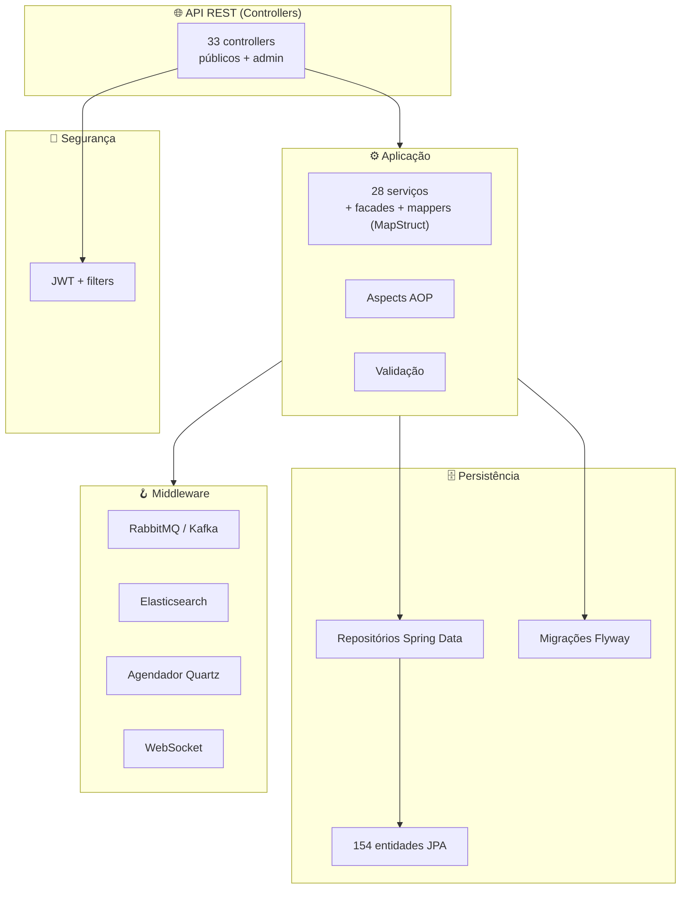
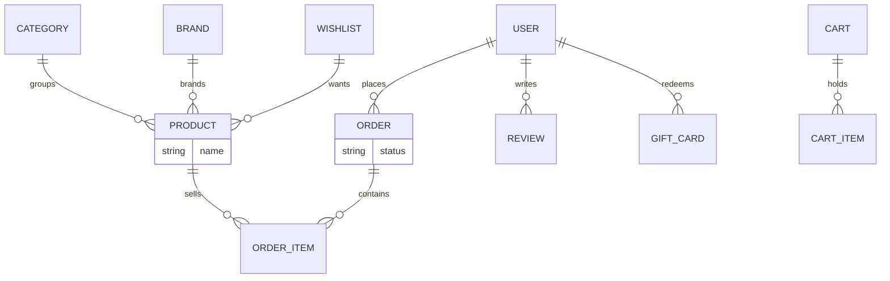
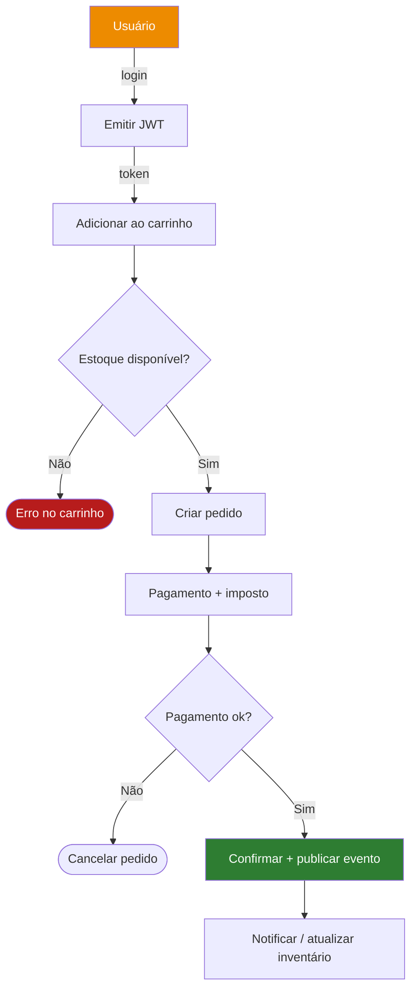

<div align="center">

**🌐 Choose Language / Selecione o Idioma / Elija el Idioma**

[](README.md)&nbsp;&nbsp;&nbsp;[](README_PT.md)&nbsp;&nbsp;&nbsp;[](README_ES.md)

</div>

---

<div align="center">

```
███████╗ ██████╗ ██████╗ ███╗   ███╗███╗   ███╗███████╗██████╗  ██████╗███████╗    ██╗ █████╗ ██╗   ██╗ █████╗
██╔════╝██╔════╝██╔═══██╗████╗ ████║████╗ ████║██╔════╝██╔══██╗██╔════╝██╔════╝    ██║██╔══██╗██║   ██║██╔══██╗
█████╗  ██║     ██║   ██║██╔████╔██║██╔████╔██║█████╗  ██████╔╝██║     █████╗      ██║███████║██║   ██║███████║
██╔══╝  ██║     ██║   ██║██║╚██╔╝██║██║╚██╔╝██║██╔══╝  ██╔══██╗██║     ██╔══╝      ██║██╔══██║╚██╗ ██╔╝██╔══██║
███████╗╚██████╗╚██████╔╝██║ ╚═╝ ██║██║ ╚═╝ ██║███████╗██║  ██║╚██████╗███████╗    ██║██║  ██║ ╚████╔╝ ██║  ██║
╚══════╝ ╚═════╝ ╚═════╝ ╚═╝     ╚═╝╚═╝     ╚═╝╚══════╝╚═╝  ╚═╝ ╚═════╝╚══════╝    ╚═╝╚═╝  ╚═╝  ╚═══╝  ╚═╝  ╚═╝
                     Plataforma E-commerce Java Completa em Recursos
```

---

[](https://openjdk.org/)
[](https://spring.io/)
[]()
[]()
[]()
[]()
[]()
[]()

<br/>

> **Uma plataforma de e-commerce completa em Spring Boot 3 com segurança JWT**
> cobrindo catálogo, carrinhos, pedidos, pagamentos, avaliações, fidelidade, gift cards, admin e busca — orquestrada sobre PostgreSQL, Redis, Kafka e Elasticsearch.

<br/>


</div>

---

## 📑 Índice

<details>
<summary>▶️ <strong>Clique para expandir / recolher esta seção</strong></summary>

<table>
<tr>
<td valign="top" width="50%">

**🏗️ Sistema**
- [Visão Geral](#-visão-geral)
- [Arquitetura do Sistema](#-arquitetura-do-sistema)
- [Stack Tecnológica](#-stack-tecnológica)
- [Padrões de Projeto](#-padrões-de-projeto-aplicados)
- [Estrutura do Projeto](#-estrutura-do-projeto)

**📦 Módulos**
- [Catálogo & Busca](#-catálogo--busca)
- [Comércio & Pagamentos](#-comércio--pagamentos)
- [Engajamento & Admin](#-engajamento--admin)

</td>
<td valign="top" width="50%">

**💼 Negócio**
- [Regras de Negócio](#-regras-de-negócio)
- [Requisitos Funcionais](#-requisitos-funcionais)
- [Requisitos Não Funcionais](#-requisitos-não-funcionais)

**🔐 Segurança & Ops**
- [Modelo de Dados](#-modelo-de-dados)
- [Fluxos do Sistema](#-fluxos-do-sistema)
- [Segurança](#-segurança)
- [Instalação & Execução](#-instalação--execução)
- [Testes Automatizados](#-testes-automatizados)
- [Métricas & Monitoramento](#-métricas--monitoramento)
- [Limitações Conhecidas](#-limitações-conhecidas)

</td>
</tr>
</table>

---

</details>

## 🌟 Visão Geral

<details>
<summary>▶️ <strong>Clique para expandir / recolher esta seção</strong></summary>

**ecommerce-java** é um backend de e-commerce completo em Spring Boot 3.2 (`com.ecommerce`, 587 arquivos Java principais). Implementa o ciclo de vida integral do varejo: usuários e papéis autenticados por JWT, catálogo de produtos com categorias e marcas, carrinhos, processamento de pedidos com pagamentos, avaliações de produtos, wishlists, gift cards, programa de fidelidade, newsletters, tickets de suporte e uma suíte admin abrangente para inventário, marketing, relatórios, webhooks, CMS e logs de auditoria.

A plataforma está pronta para escala com PostgreSQL (JPA + migrações Flyway), Redis (cache + sessões), Elasticsearch (busca), RabbitMQ e Kafka (mensageria/eventos), Quartz (agendamento), WebSocket (tempo real) e documentação OpenAPI.

### 🎯 Objetivos do Sistema

| Objetivo | Descrição |
|----------|-----------|
| 🛒 **Comércio completo** | Catálogo, carrinhos, pedidos, pagamentos, avaliações |
| 🎁 **Fidelidade & presentes** | Programa de fidelidade, gift cards, devoluções |
| 🛠️ **Admin rico** | Inventário, marketing, relatórios, webhooks, CMS, suporte |
| 🔍 **Busca rápida** | Busca de produtos com Elasticsearch |
| 🔐 **Acesso seguro** | JWT + Spring Security, papéis e auditoria |
| ⚙️ **Pipelines escaláveis** | Redis, Kafka, RabbitMQ, Quartz, WebSocket |

---

</details>

## 🏗️ Arquitetura do Sistema

<details>
<summary>▶️ <strong>Clique para expandir / recolher esta seção</strong></summary>

### Diagrama de Módulos



Camadas de controllers → serviços → repositórios com aspects transversais, protegidas por cadeia de filtros JWT e suportadas por um backbone async/event-driven.

---

</details>

## 🛠️ Stack Tecnológica

<details>
<summary>▶️ <strong>Clique para expandir / recolher esta seção</strong></summary>

<table>
<thead>
<tr><th>Camada</th><th>Tecnologia</th><th>Versão</th><th>Finalidade</th></tr>
</thead>
<tbody>
<tr><td><strong>🧠 Linguagem</strong></td><td>Java</td><td>17</td><td>Toda a lógica — 587 arquivos</td></tr>
<tr><td><strong>🌐 Framework</strong></td><td>Spring Boot</td><td>3.2.0</td><td>Web, JPA, Security, Validation, Mail, AOP</td></tr>
<tr><td><strong>🗄️ Banco</strong></td><td>PostgreSQL / H2</td><td>16 / runtime</td><td>Banco principal e de testes</td></tr>
<tr><td><strong>🧬 Migrações</strong></td><td>Flyway</td><td>Mais recente</td><td>Versionamento do schema</td></tr>
<tr><td><strong>🔍 Busca</strong></td><td>Elasticsearch</td><td>Starter</td><td>Índice de busca de produtos</td></tr>
<tr><td><strong>📨 Mensageria</strong></td><td>RabbitMQ + Kafka</td><td>Starter</td><td>Eventos/streams async</td></tr>
<tr><td><strong>⚡ Cache</strong></td><td>Redis + Spring Cache</td><td>3.2.0</td><td>Caching + sessões</td></tr>
<tr><td><strong>🔐 Auth</strong></td><td>JWT (jjwt)</td><td>0.12.3</td><td>Autenticação por token</td></tr>
<tr><td><strong>📋 Mapeamento</strong></td><td>MapStruct + ModelMapper</td><td>1.5.5</td><td>Mapeamento de DTOs</td></tr>
<tr><td><strong>🧪 Testes</strong></td><td>JUnit + Testcontainers</td><td>—</td><td>40 arquivos de teste</td></tr>
<tr><td><strong>📜 Docs</strong></td><td>springdoc-openapi</td><td>2.3.0</td><td>Swagger/OpenAPI</td></tr>
</tbody>
</table>

---

</details>

## 🎨 Padrões de Projeto Aplicados

<details>
<summary>▶️ <strong>Clique para expandir / recolher esta seção</strong></summary>

| Padrão | Onde | Justificativa |
|--------|------|---------------|
| 🏗️ **Arquitetura em camadas** | Controller / service / repository | Separação clara de responsabilidades |
| 🏭 **Facade** | pacote `facade` | Simplifica combinações complexas de serviços |
| 🔄 **Mapper pattern** | Mappers MapStruct | Conversão Entidade ↔ DTO em tempo de compilação |
| ✂️ **AOP** | pacote `aspect` | Preocupações transversais (logging, segurança) |
| 📨 **Event-driven** | Kafka/RabbitMQ `messaging` + listeners | Fluxos async desacoplados |
| ⛓️ **Filter chain** | `security` filtro JWT | Autenticação central |
| 📅 **Agendador** | Quartz `scheduler` | Jobs periódicos (relatórios, alertas) |

---

</details>

## 📁 Estrutura do Projeto

<details>
<summary>▶️ <strong>Clique para expandir / recolher esta seção</strong></summary>

```
ecommerce-java/
├── 📄 pom.xml                       # Build Maven (Spring Boot 3.2.0)
├── 📂 src/main/java/com/ecommerce/
│   ├── 📂 controller/               # 33 controllers REST
│   ├── 📂 service/                  # 28 serviços de aplicação
│   ├── 📂 model/entity/             # 154 entidades JPA
│   ├── 📂 repository/               # Repositórios Spring Data
│   ├── 📂 config/                   # 14 classes @Configuration
│   ├── 📂 security/                 # JWT + cadeia de filtros
│   ├── 📂 messaging/ listener/      # Kafka/RabbitMQ
│   ├── 📂 facade/ mapper/ aspect/
│   ├── 📂 scheduler/ event/ handler/
│   └── 📂 exception/ util/ validation/
├── 📂 src/test/                     # 40 arquivos de teste
├── 📂 docker/  scripts/  docs/
└── 📄 README.md / README_PT.md / README_ES.md
```

---

</details>

## 📦 Módulos do Sistema

<details>
<summary>▶️ <strong>Clique para expandir / recolher esta seção</strong></summary>

### 🔍 Catálogo & Busca

`ProductController` + `CategoryController` + `BrandController` + `SearchController`, avaliações de produtos, wishlists e busca com Elasticsearch sobre o modelo JPA de 154 entidades.

### 💳 Comércio & Pagamentos

`CartController`, `OrderController`, `PaymentController`, `TaxController`, endereços, gift cards, fidelidade e devoluções — o backbone transacional com publicação de eventos RabbitMQ/Kafka.

### 🎛️ Engajamento & Admin

`AuthController`, `UserController`, `NotificationController`, `NewsletterController`, tickets de suporte, mais a família `Admin*`: analíticos, log de auditoria, CMS, inventário, marketing, relatórios, configurações, webhooks e gestão de busca.

---

</details>

## 📋 Regras de Negócio

<details>
<summary>▶️ <strong>Clique para expandir / recolher esta seção</strong></summary>

| # | Regra | Aplicação |
|---|-------|-----------|
| BR-01 | Somente usuários autenticados podem fazer pedidos | Serviço de pedidos consciente de JWT |
| BR-02 | Itens do carrinho devem referenciar produtos válidos | Verificações de repositório/validação |
| BR-03 | Pagamentos controlam a transição de estado do pedido | Serviço de pagamento antes da confirmação |
| BR-04 | Endpoints de admin exigem papéis privilegiados | Controllers `Admin*` protegidos por papel |
| BR-05 | Pontos de fidelidade e gift cards reduzem o total | Lógica de negócio na camada de serviço |

---

</details>

## ✅ Requisitos Funcionais

<details>
<summary>▶️ <strong>Clique para expandir / recolher esta seção</strong></summary>

| ID | Requisito | Prioridade | Status |
|----|-----------|------------|--------|
| **RF-01** | Registrar, autenticar e gerir usuários (JWT) | 🔴 Alta | ✅ Implementado |
| **RF-02** | Navegar categorias, marcas e catálogo de produtos | 🔴 Alta | ✅ Implementado |
| **RF-03** | Gerir carrinhos e fazer pedidos com pagamentos | 🔴 Alta | ✅ Implementado |
| **RF-04** | Escrever avaliações de produtos e gerir wishlists | 🟡 Média | ✅ Implementado |
| **RF-05** | Rodar programa de fidelidade e gift cards | 🟡 Média | ✅ Implementado |
| **RF-06** | Admin: inventário, marketing, relatórios, webhooks, CMS | 🟡 Média | ✅ Implementado |
| **RF-07** | Busca de produtos full-text via Elasticsearch | 🟡 Média | ✅ Implementado |
| **RF-08** | Coletar métricas e expor docs OpenAPI | 🟡 Média | ✅ Implementado |

---

</details>

## ⚡ Requisitos Não Funcionais

<details>
<summary>▶️ <strong>Clique para expandir / recolher esta seção</strong></summary>

| ID | Categoria | Requisito | Alvo |
|----|-----------|-----------|------|
| **RNF-01** | 🔐 Segurança | Segurança de API por token | JWT + Spring Security |
| **RNF-02** | ⚡ Performance | Leituras em cache | Redis + Spring Cache |
| **RNF-03** | 📈 Escalabilidade | Processamento async desacoplado | Kafka + RabbitMQ |
| **RNF-04** | 🔍 Busca | Consultas full-text rápidas | Elasticsearch |
| **RNF-05** | 📊 Observabilidade | Actuator + OpenAPI | spring-boot-actuator/springdoc |
| **RNF-06** | 🧱 Manutenibilidade | Código em camadas e testável | 40 arquivos de teste |

---

</details>

## 🗄️ Modelo de Dados

<details>
<summary>▶️ <strong>Clique para expandir / recolher esta seção</strong></summary>



154 entidades JPA são versionadas por migrações Flyway contra PostgreSQL (H2 nos testes); Redis armazena em cache leituras quentes e o Elasticsearch indexa produtos para busca.

---

</details>

## 🔄 Fluxos do Sistema

<details>
<summary>▶️ <strong>Clique para expandir / recolher esta seção</strong></summary>



---

</details>

## 🔐 Segurança

<details>
<summary>▶️ <strong>Clique para expandir / recolher esta seção</strong></summary>

### Controles Implementados

| Controle | Implementação |
|----------|---------------|
| 🔑 **Auth JWT** | jjwt + cadeia de filtros Spring Security |
| 🚦 **Papéis** | Controllers admin privilegiados controlados por papel |
| 🛂 **Validação de entrada** | `spring-boot-starter-validation` + validators custom |
| 🔒 **Tratamento de senha** | Encoder do Spring Security |
| 📋 **Auditoria** | Log de auditoria admin + endpoints de auditoria do usuário |

### Limitações de Segurança Conhecidas

| Limitação | Risco | Caminho de mitigação |
|-----------|-------|----------------------|
| 🔐 **Refresh/revogação** | Vida útil do JWT vs. revogação | Adicionar refresh tokens + blacklist no Redis |
| 🌐 **Hardening de deploy** | Segredos/PLAIN config em dev | Usar vault por env para produção |

---

</details>

## 🚀 Instalação & Execução

<details>
<summary>▶️ <strong>Clique para expandir / recolher esta seção</strong></summary>

### Pré-requisitos

```bash
java -version           # JDK 17+
docker --version        # para PostgreSQL/Redis/etc via compose
```

### Compilar & Executar

```bash
mvn clean install
mvn spring-boot:run
```

Testes usam Testcontainers para PostgreSQL:

```bash
mvn test
```

---

</details>

## 🧪 Testes Automatizados

<details>
<summary>▶️ <strong>Clique para expandir / recolher esta seção</strong></summary>

40 arquivos de teste em `src/test` cobrem serviços e camadas web:

```bash
mvn test
```

- **JUnit + spring-boot-starter-test** para unit/integração
- **Testcontainers (postgresql)** para integração com banco real
- **spring-security-test** para verificação de endpoints protegidos
- **junit-dataprovider** para casos orientados a dados

---

</details>

## 📊 Métricas & Monitoramento

<details>
<summary>▶️ <strong>Clique para expandir / recolher esta seção</strong></summary>

| Métrica | Valor |
|---------|-------|
| Arquivos Java | 587 |
| Entidades | 154 |
| Controllers | 33 |
| Serviços | 28 |
| Configs Spring | 14 |
| Testes | 40 |

O Spring Boot Actuator expõe endpoints de health/métricas; o springdoc-openapi serve a UI Swagger e o spec OpenAPI.

---

</details>

## ⚠️ Limitações Conhecidas

<details>
<summary>▶️ <strong>Clique para expandir / recolher esta seção</strong></summary>

| Categoria | Problema | Status |
|-----------|----------|--------|
| 🔍 **Sync de busca** | Consistência do índice com o RDBMS | ⚠️ Aberto — alinhar via eventos |
| 🎛️ **Amplitude do admin** | Muitos módulos admin, profundidade desigual | ⚠️ Aberto — refinar por módulo |
| 🔐 **Ciclo de vida do token** | Sem refresh/revogação de JWT | ⚠️ Aberto — adicionar fluxo de refresh |

</details>

---

<div align="center">

---

### 🛒 ecommerce-java

*Todo fluxo de varejo, uma única plataforma Spring Boot*

[]()
[]()

<br/>

```
"Do carrinho à fidelidade, da busca ao admin — uma loja completa em código."
```

</div>
